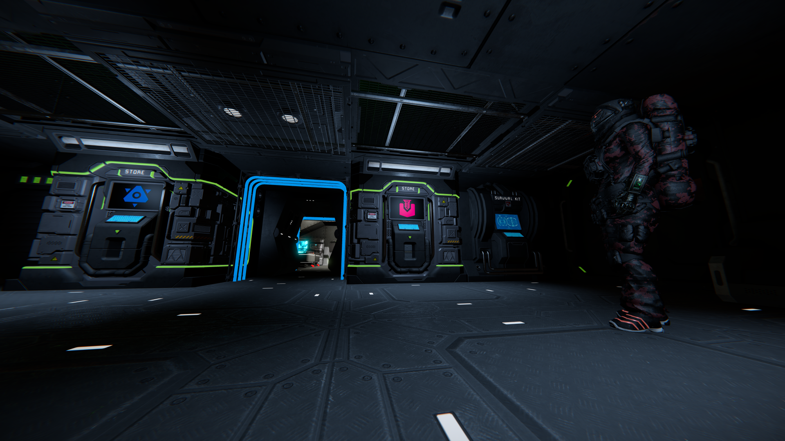
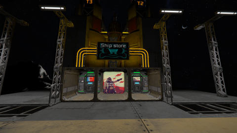
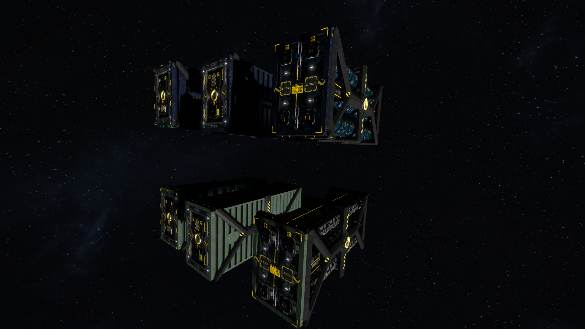

<!-- title: Luyten World: Progression Guide --> 
# The Start
You have 4 choices of when starting:

| Space | Planet26 | Mars | Teal 
| :--------------------------------------------- | :---------------------------------------- | :---------------------------------------- | :---------------------------------------- |
|  |  |  |  
 | Large grid miner | Small grid rover - 1g - O2 | Small grid rover - 0.9g | Small grid rover - 1g - O2

Important notes:
* The jetpack is a bit more realistic than vanilla
* Stone can only be processed by a Survival Kit

Building in gravity will be challenging, get an utility ship to help you

All the big changes and new mechanics are described [here](README.md)

## Space Start
You will spawn in a large grid miner in one of the 2 ice hotspots:
**Hyakutake or Borrelly**

First thing you want to do is mining some ice for your O2 and H2 and map the asteroid on your way to the ice cluster.

The progression then is basically the same as vanilla: **Get a refinery and assembler going**

**Remember: you cannot have your station base in the hotspots, go to the Fast Zone to build it**

Once you have production capabilities you'll need **gold** and **silver** to get to your first JumpDrive, renamed Transit System.
=> It will unlock the custom made **Transit System** allowing you to travel in Luyten at high speed (12km/s)

**You'll now have access to the mid game where you can choose how you'll interact with the economy**

## Planet start
You will spawn in a small grid rover and be parachuted on the planet's surface

First thing you want to do is a bit a scouting to find:
* Iron
* Nickel
* Silicon
* Cobalt

The progression then is basically the same as vanilla: **Get a refinery and assembler going**

Once you have production capabilities you'll need gold and silver to get to your first JumpDrive, renamed Transit System.
=> It will unlock the custom made **Transit System** allowing you to travel in Luyten at high speed (12km/s)

**You'll now have access to the mid game where you can choose how you'll interact with the economy**

# Mid game
You progression will now be **tied to the economy** by making some sweet space cash.
There is 3 hub stations hosting different economy factions:

| Eos Station | Zorya Refinery Station | Anshar Research Station
| :--------------------------------------------- | :---------------------------------------- | :---------------------------------------- |
|  |  | 

### Stores

You can sell resources there to make your first money, the rarer the resource the higher the reward

Zorya is special as it offers very interesting **services for new players**:
* Buy basic starter ships (Haulers, Miners)

* Exchange ores for ingots skipping refining time for a price
* Exchange ice for O2 or H2 skipping the processing time for a price

### Trading
The 3 hubs store listings and prices are set so you can do item trading runs between them
You'll have to discover what route and items to move between stations

### Physical Freight

As the title suggest, there is special store where you can buy containers grids, you'll have to transport them to another station to get your pay
The longer the travel the better the reward
  
# Road to end game
Now that you have an income you'll get the funds to buy the economy locked components needed for the more advanced blocks:
* Static Drill
* Bigger thrusters
* Reactors
* Gravity generators
* Artificial masses
* Build and repair systems
* Torpedoes and Torpedo launchers
* Railguns

Have fun playing!
All the big changes and new mechanics are described [here](README.md)
