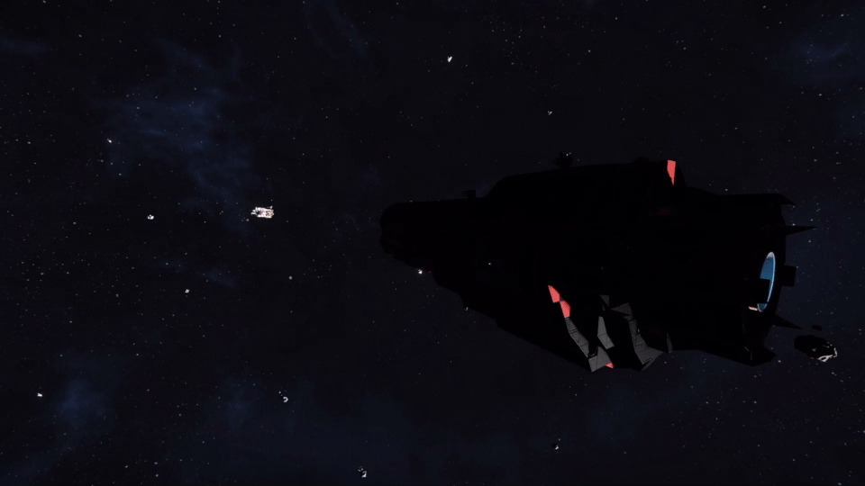

<!-- title: Luyten World --> 
# The World
    Luyten is a 3 Planet Star-system:

* **Planet-26** : A earth like planet (Rover start - 1g)
    * Satellite: **Moon**

* **Mars** : A mars-like planet (Rover start - 0.9g - No oxygen)
    * Satellite: **Europa**

* **Luma** : A gas-giant (Start on its Satellite)
    * Satellite: **Teal**

    A lot of things have been changed to make the game feel more 
    goal oriented and have you travel around the system

## World settings
The idea behind Luyten was to promote traveling around the system, make grouping with other people worthwhile and remove the "*do this once and be done*" feeling of the vanilla experience:

**No Uranium ore** is present in asteroids, players can buy it from one NPC Provider (**Type One Energy**) or mine it at the Dangerous Uranium Hotspot (**Lutecia Hotspot - KMDI controlled**)

**Reactor and Gravity components are now end game** and locked up behind a NPC Provider (**Tech Noir**)

-> Playing with gravity and high power density generation is now  more "active" with money-to-component grind and money-to-uranium grind

-> This will make end game ships and bases use the Economy System

## World Map

The world is divided in 3 zones:
* Planets (described above)
* Hubs
* Hot spots

## Hubs
### Eos Station: Central Hub

*Eos Station* is at the center of system

It's the main Trading Hub where you can buy everything **except Gravity & Reactor components**

And the only host of *Type One Energy* (**Uranium supplier**) and *Nariman Dynamics* (**Ammo and Zonechips supplier**)

### Anchar Station: Research Hub

*Tech Noir*'s Anchar Station is the place to buy **all your components**

Their mastery in high tech R&D make them the only place to buy **Reactor & Gravity components**

They are in high demand of ingots to power their labs

### Zorya Station: Outer Hub

Zorya Station was build by *G.C. Metals & Cryogenics* in conjunction with *Emerling-Voss Minerals*

This is the home of everything **Ore & Ingot related**
You can also sell grids here for space cash

## Hotspots
### Lutecia Hot spot: Uranium cluster
A small cluster of rather large pure Uranite asteroids and defended by the KMDI Faction

Don't get spotted or come with support

### Hyakutake Hot spot: Fragmented Ice comet

### Borrelly Hot spot: Ice cluster

## NPC Providers
|  | Energy Provider: Type One Energy (Dan Wu) |
| :--------------------------------------------- | :---------------------------------------- |

    -> Uranium Ingots
    -> H2 & O2 Gas
    Presence: Eos Station - Central Hub

|  | Tech Provider: Tech Noir (Mike Grey) |
| :--------------------------------------------- | :----------------------------------- |

    -> Reactor components
    -> Gravity components
    -> All other components
    -> H2 & O2 Gas
    Presence: Anchar Station - Research Station

|  | Ore Provider: Emerling-Voss Minerals (Wenna Hemingway) |
| :--------------------------------------------- | :----------------------------------------------------- |

    -> Every ores Except Uranium
    Presence: Eos Station - Central Hub, Zorya Station - Outer Hub

|  | Component Provider: Nariman Dynamics (Warwick Wishmonger) |
| :--------------------------------------------- | :-------------------------------------------------------- |

    -> Every components except Reactor and Grav
    -> ZoneChips
    -> Missiles
    Presence: Eos Station - Central Hub

|  | Refined goods Provider: G.C. Metals & Cryogenics (David Zeus) |
| :---------------------------------------------- | :------------------------------------------------------------ |

    -> Every ingots except Uranium
    -> H2 & O2 Gas (Zorya)
    Presence: Eos Station - Central Hub, Zorya Station - Outer Hub

## Game loops
**The economy system is now in a central place to give short and long term goals**

Progression is made by either *mining*, *trading*, *hauling contracts*, *hunting* or *scavenging* until endgame (Uranium, Reactors, Gravity Drives)

    Players will have to make space cash to advance to end game
    Players will have access to basic space faring capabilities (Buffed hydro and low/mid energy sources)

Added physical cargo hauling contracts so your Hauler builds are now useful!
Added a Grid to Space cash mechanic for you hunters!

# Core Game Rebalance
## Mining
Decreased Ore collection ratios:
* Iron from 5 to 3.3
* Magnesium from 3 to 2
* Uraninite from 1 to 0.3
* Nickel from 3 to 1.5
* Cobalt from 3 to 1.5
* Silicon from 3 to 1
  
It was way too easy to produce big projects after a single mining campagne

## Ingots & Components
Silver ingots are now included in the production of:
* Superconductor : 0.5kg per component
* Thruster components: 0.5kg per component
This is to make silver mining more relevant instead of the current *mine one node and be done*

Gravel production is now reduced by a factor of 10

TODO: make gravel relevant somehow

## Blocks
### Energy Generation
Some energy generation blocks have been buffed to accommodate the new progression to end game
#### Hydro Engines
Max power output doubled from 5 to 10MW and 0.5 to 1MW

Fuel efficiency doubled from 0.01 to 0.02
#### Solar Panel
Power Output doubled from 0.16 to 0.32MW and 0.04 to 0.08MW

### Jump Drive
Recipe: Changed Gravity Generator requirement to 100 Superconductors

### Safe Zone
Recipe: Changed Gravity Generator requirement to 300 Superconductors

Buffed ZoneChips duration x3 (from 60 to 180min)

### Ship Tools
Ship tools received some QoL buffs
#### Welder
Small welder range increased from 1.3 to 2.5m

Large welder range increased from 2.26 to 5.5m
#### Drill
Small Drill range offset increased from 0.6 to 0.8m

Large Drill range increased from 1.9 to 2.35m, offset from 2.8 to 4.2m
#### Ore Detector
Small Ore Detector range increased from 50 to 75m

Large Ore Detector range increased from 150 to 300m
### Hatch Doors
Doubled opening and closing speed (from 2 to 4) to make it inline with normal sliding door

## Audio
    Hydrogen thruster sounds have been revamped
    Large Industrial Thruster make a Epstein-Drive like sound effect when starting up
    "Ship Engine" sound effects have been made quieter to preserve immersion
    Large railguns now pack a punch

FIXME: Small ship sound effects are globally low <== Game limitation

# MES PVE NPC Factions
* Knighmare Defense Industries (very difficult encounters)

  * They will guard fiercely the Lutecia Hot Spot
  * Players will have to come with combat ships to mine or will have to hide/flee
  * Custom made for the scenario
* Valkyrja Mad Eagles (difficult encounters)
  * An aggressive pirate faction
  * Custom made for the scenario
* Reavers 
* Imber
* Incon
* Parallax
* SPRTE

# World Navigation, Comms & Combat
    The world comes with a custom version of Relative Top Speed,
    custom WeaponCore Vanilla replacer, Thrust Signature, Jump Drive Inhibitor & Jump Alert

## Navigation: Dynamic Max Speed

    There is now 3 max speeds:
        Fast Space Zone: 5000m/s
        Slow Space Zones: 500m/s
        Planets: 150m/s
    Your speed will increase linearly going from the planet's surface to space (40km)

The Thrust to Weight Ratio will influence your cruise speed and max boost speed: *be careful when building* :D
Having a JumpDrive on board will give you better boost speed

## Navigation: Hydrogen rebalance

    Large hydrogen thrusters have a x3 thrust increase
    Small hydrogen thrusters have a x1.25 thrust increase
    Hydrogen efficiency buffed by 1.38 as it'll be used 
    for power and travel in this rebalance

## Comms: Thrust Signature

    All player grids must have at least one beacon
    That beacon will emit your signature when you have active 
    thrusters/gravity drive or have active power producers
    Average ships will be visible up to 30km during thrust, be careful how you navigate
    or get spotted!
    Thruster plumes are visible up to 8km

## Comms: Antennas
    Laser Antennas does not need line of sight anymore
    The power requirement have been halved to accommodate
    trade-locked high power generation

## Combat: WC Vanilla replacer
Luyten use Weaponcore to have a better and smoother combat experience: 
**Combat has now 4 engagement ranges:**

**10km to 5km Torpedo Range**

    -> Static rocket launchers now fire homing torpedoes
    they have high damage but can be shot down by PDCs
    -> They have a max speed of 400:150m/s (large:small)
    -> Launchers will overheat after shooting 4 torpedoes
    -> Reload speed of 40s after 8 torpedo shots
    This make PDC mandatory on all ships, good acceleration/maneuverability helps too

**6km Railgun range**

    -> Large Railgun charge is now 30s from 1min
    -> Small Railgun powerdraw increased from 38MW to 76MW (x2)
    -> Large Railgun Sabot will pierce through entire grids
    -> Large Railgun Sabot is now red with a shorter trail line

    -> Small Railgun charge is now 10s from 15s
    -> Small Railgun powerdraw increased from 3.6MW to 7.2MW (x2)
    -> Small Railgun Sabot has a 3.5km range and will damage up to 2 large grid heavy blocks
    -> Small Railgun Sabot has now a shorter trail line

    -> Railgun sabots will take 1sec to reach its target from max range
    -> Increased backkick force by 10 to make railgun's shot feel powerful
    
    This make Railguns more relevant during fights and a real end game weapon
    Railguns will overheat if used too much on cooldown

**4km/3km Cannon range**

    -> Artillery range is 4km and Vanilla damage
    -> Assault Canon range is 3km and Vanilla damage
    -> Assault Canon shell tracers now have a red hue
    This is for better visual contrast from Artillery Shells
    
**1.5km CQB**

    -> Gatling turrets act now as PDCs, they will shoot down incoming missiles
    -> Gatling tracer is now Orange and visible up to 5km
    -> Gatling turret and gun have 133% fire rate (from 700rpm to 1060rpm)
        and ~66% the damage (from 90 to 60)
    -> Gatling turret rotation speed and accuracy increased by x10
    -> Gatling ammo is bit more potent against non-armor blocks (+10%)
    -> Gatlings have now an overheat mechanic to avoid mindless spray and pray
    -> Missiles turret range increased from 800m to 1km (Dumb fire rockets)
    -> Interior turret is same as Vanilla

This rebalance is done to make ships roles more contrasted: ship speeds, armouring and weapon loadouts are now linked

Note: *this rebalance was done with your existing blueprints in mind.
They should keep their relevance in and out of Luyten's settings.*

## Combat: Ammo recipes
    Missiles:                       + Increased Uranium x10
                                    + Increased Magnesium x1.25
                                    - Removed Platinum
    Artillery Shell:                + Increased Uranium x5
    Large & Small Railgun Sabots:   + Increased Uranium x3
Going into battle was almost free with high-end weapons, now proper logistics and planning is mandatory
# Block limits
Block spamming is a real performance issue in Space Engineers and does not promote sharing grids between players,

To fix those weaknesses the following rules applies:
## Max Per Grid
### Tools
    25 Welders
    25 Grinders
    25 Drills
    2 Build and Repairs
### Productions
    12 Refineries (Basic & Normal)
    12 Assemblers (Basic & Normal)
    32 O2/H2 Generators
    30 Hydrogen Tanks
    10 Oxygen Tanks
### Weapons
    12 Rocket Launchers
    16 Large Railguns
    8  Small Railguns
    15 of each Turrets
    15 CTC
### Misc
    3 Respawn points (Survival Kits & Medical Rooms)
    56 Gravity generators
    56 Mass blocks

## Max Per Players
### Tools
    50 Welders
    50 Grinders
    25 Drills
    8 Build and Repairs
### Productions
    24 Refineries (Basic & Normal)
    24 Assemblers (Basic & Normal)
    88 O2/H2 Generators
### Weapons
    24 Rocket Launchers
    24 Railguns
### Automation
    30 Programmable Blocks
    30 Event controllers
    40 Timer Blocks
    15 AI Offense / AI Defense
    20 AI Move
    15 AI Basic / Recorder
### Misc
    60 Hydrogen Tanks
    20 Oxygen Tanks 
    8 Respawn points (Survival Kits & Medical Rooms)

# Credits
Weaponcore: Darkstar & al
Relative Top Speed: Gauge
Elite Dangerous - FSD Supercruise: Dorimanx & Specter
Freight Contract: Patrick
Store block: diK
Nebula: Jakaria
Modular Encounter System: Meridius_IX / Lucas
KMDI Ships: Papple2
VME Ships: Taidyr

Trade Hubs:
* Anshar Station: Cross-1 Research Station by Trav
* Eos Station: NEXUS - Deep Space Outpost by MACH Velocity
* Zorya Station: Hydrogen Refinery by Vomsay