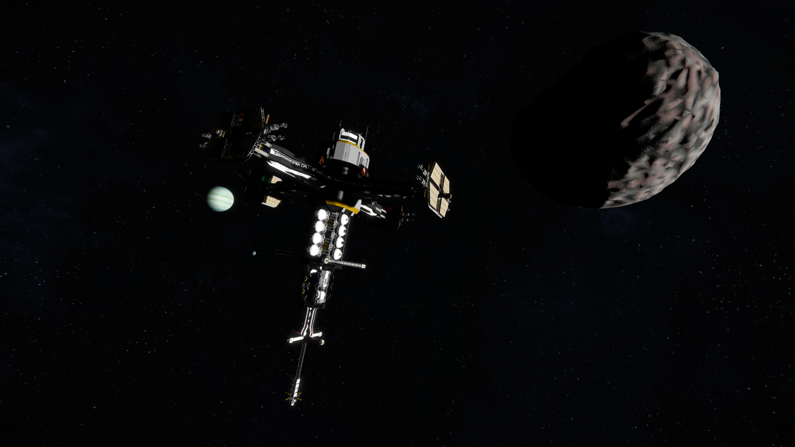
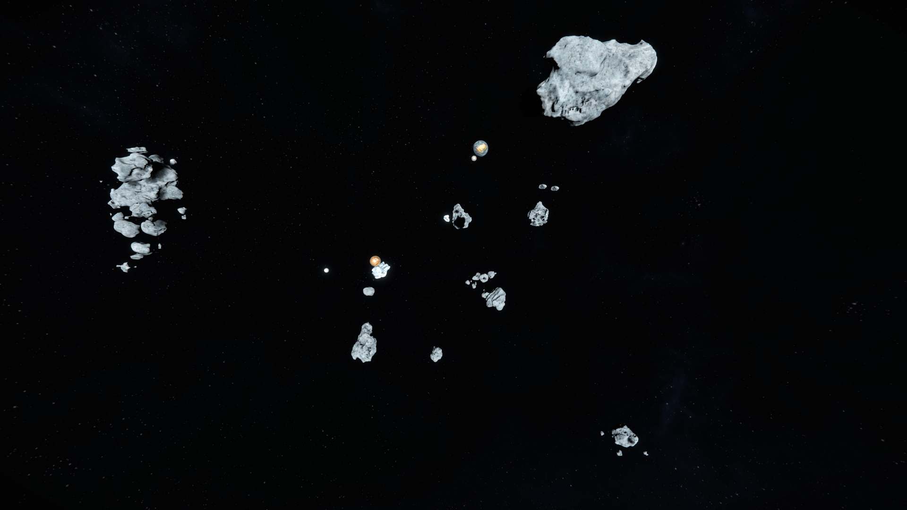

<!-- title: Luyten World --> 
# The World
    Luyten is a 3 Planet Star-system:

* **Planet-26** : A earth like planet (Rover start - 1g)
    * Satellite: **Moon**

* **Mars** : A mars-like planet (Rover start - 0.9g - No oxygen)
    * Satellite: **Europa**

* **Luma** : A gas-giant (Rover start on its Satellite - 1g)
    * Satellite: **Teal**

    A lot of things have been changed to make the game feel more 
    goal oriented and have you travel around the system

## World settings
The idea behind Luyten was to promote traveling around the system, make grouping with other people worthwhile and remove the "*do this once and be done*" feeling of the vanilla experience:

**No Uranium ore** is present in asteroids, players can buy it from one NPC Provider (**Type One Energy**) or mine it at the Dangerous Uranium Hotspot (**Lutecia Hotspot - KMDI controlled**)

**Reactor and Gravity components are now end game** and locked up behind a NPC Provider (**Tech Noir**)
**Railgun and Torpedo components are now end game** and locked up behind a NPC Provider (**Tech Noir** and **Nariman Dynamics**)

-> Playing with gravity and high power density generation is now more "active" with money-to-component grind and money-to-uranium grind

-> This will make end game ships and bases use the Economy System

You can find a new player guide [here](NewPlayerGuide.md)

## World Map

The world is divided in 4 zones:
* Planets (described above)
* Hubs
* Hot spots
* Fast Zone (rest of space)

## Hubs
### Eos Station: Central Hub

*Eos Station* is at the center of system

It's the main Trading Hub where you can buy everything **except Gravity, Reactor components**

And the only host of *Type One Energy* (**Uranium supplier**) and *Nariman Dynamics* (**Ammo, Guidance System and Zonechips supplier**)

### Anchar Station: Research Hub

*Tech Noir*'s Anchar Station is the place to buy **all your components**

Their mastery in high tech R&D make them the only place to buy **Reactor & Gravity components** and other end game components like **Accumulators and Nanite Containers**

They are in high demand of ingots to power their labs

### Zorya Station: Outer Hub

Zorya Station was build by *G.C. Metals & Cryogenics* in conjunction with *Emerling-Voss Minerals*

This is the home of everything **Ore, Ingot & Gas related**

***You can also sell grids here for space cash and buy basic ships***

## Hotspots
### Lutecia Hot spot: Uranium cluster
A small cluster of rather large pure Uranite asteroids and defended by the KMDI Faction

Don't get spotted or come with support

Normal asteroid will spawn in a 100km radius from this cluster for space mining

### Hyakutake Hot spot: Fragmented Ice comet

Normal asteroid will spawn in a 100km radius from this cluster for space mining

### Borrelly Hot spot: Ice cluster

Normal asteroid will spawn in a 100km radius from this cluster for space mining

## NPC Providers
|  | Energy Provider: Type One Energy (CEO: Dan Wu) |
| :--------------------------------------------- | :---------------------------------------- |

    -> Uranium Ingots
    -> H2 & O2 Gas
    Presence: Eos Station - Central Hub

|  | Tech Provider: Tech Noir (CEO: Mike Grey) |
| :--------------------------------------------- | :----------------------------------- |

    -> Reactor components
    -> Gravity components
    -> Accumulators
    -> Nanite containers
    -> All other components except Guidance System
    -> H2 & O2 Gas
    Presence: Anchar Station - Research Station

|  | Component Provider: Nariman Dynamics (CEO: Warwick Wishmonger) |
| :--------------------------------------------- | :-------------------------------------------------------- |

    -> Every components except Reactor, Gravity, Accumulator & Nanite Containers
    -> ZoneChips
    -> Guidance System
    Presence: Eos Station - Central Hub

|  | Refined goods Provider: G.C. Metals & Cryogenics (CEO: David Zeus) |
| :---------------------------------------------- | :------------------------------------------------------------ |

    -> Every ingots except Uranium
    -> H2 & O2 Gas
    Presence: Eos Station - Central Hub, Zorya Station - Outer Hub

|  | Ore Provider: Emerling-Voss Minerals (CEO: Wenna Hemingway) |
| :--------------------------------------------- | :----------------------------------------------------- |

    -> Every ores Except Uranium
    Presence: Eos Station - Central Hub, Zorya Station - Outer Hub

|  | Physical Freight: Transport Union (CEO: Susan Morningstar) |
| :---------------------------------------------- | :------------------------------------------------------------ |

    -> Physical freight
    -> Beginner Ships (Zorya)
    Presence: Eos Station, Zorya Station, Anchar Station

## Gameplay loops
**The economy system is now in a central place to give short and long term goals**

Progression is made by either *mining*, *trading*, *hauling cargo*, *hunting* or *scavenging* until endgame (Uranium, Reactors, Gravity Drives)

    Players will have to make space cash or pirate NPCs to advance to end game
    Players will have access to basic space faring capabilities
    (Buffed hydro and low/mid energy sources)

Added physical cargo hauling so your Hauler builds are now useful!
    Those physical cargo are purchasable at any Trade Station and will automatically grant you a nice reward when you navigate to another Trade Station

Added a Grid to Space cash mechanic for you hunters!
    If you hate grinding the grid you hunted, you can now take them to a specific station and sell them for sweet cash :)

# Core Game Rebalance
## Mining
Decreased Ore collection ratios:
* Iron from 5 to 3.3
* Magnesium from 3 to 2
* Uraninite from 1 to 0.3
* Nickel from 3 to 1.5
* Cobalt from 3 to 1.5
* Silicon from 3 to 1
  
It was way too easy to produce big projects after a single mining campaign

Regular Asteroids (no ice, no uranium) only spawn in a 100km radius of all Hot Spots (Borrelli, Lutecia, Hyakutake)

## Ingots & Components
Stone is now only processed in the Survival Kit, lets go back to the old SE!

Silicon is now required for:
* Construction Components 0.1kg per component
* Motors 0.5kg per component
* Detector Components 3kg per component

Nickel is now required for:
* Construction Components 0.1kg per component
* Computers 0.01kg per component
* Radio Communication Components 3kg per component
  
Silver ingots are now included in the production of:
* Superconductor : 0.5kg per component
* Thruster components: 0.5kg per component
  
This is to make Silicon, Silver and Nickel mining more relevant instead of the current *mine one node and be done*

Gravel production is now reduced by a factor of 10 and has no usefulness for the moment

## Blocks
### Power Generation
Some power generation blocks have been buffed or nerfed to accommodate the new progression and end game
All active power generation blocks have now a shared
* PCU cost of 500
* Block limit per grid of 34

**If you want more power density for the same PCU cost you'll have to progress from the lower tech to higher tech**

#### Solar Panels
Power Output x1.5 from 0.16 to 0.240MW and 0.04 to 0.06MW

#### Hydro Engines
Max power output doubled from 5 to 10MW and 0.5 to 1MW
PCU is now 500

#### Reactors
Large reactors will consume 2 times more uranium than vanilla
Small reactors will consume 3 times more uranium than vanilla
Block limit of 10 per grid
PCU is now 500

It will compensate the lack of JumpDrive charge when moving around the system and act as a money sink
while promoting the use of the large reactors over small reactors spamming

### Batteries
Max input power lowered from 12MW to 8MW
Block limit of 18 per grid
PCU is now 500
*This is to promote battery as buffers and not main power sources*

### Jump Drive
Recipe: Changed Gravity Generator requirement to 100 Superconductors

Added a small grid version

### Safe Zone
Recipe: Changed Gravity Generator requirement to 300 Superconductors

Buffed ZoneChips duration x3 (from 60 to 180min)

### Ship Tools
Ship tools received some QoL buffs
#### Welder
Small welder range increased from 1.3 to 2.5m

Large welder range increased from 2.26 to 5.5m
#### Drill
Small Drill range offset increased from 0.6 to 0.8m

Large Drill range increased from 1.9 to 2.35m, offset from 2.8 to 4.2m
#### Ore Detector
Small Ore Detector range increased from 50 to 75m

Large Ore Detector range increased from 150 to 300m
### Hatch Doors
Doubled opening and closing speed (from 2 to 4) to make it inline with normal sliding door

# Engineer, suit & Jetpack
A jetpack, a grinder and a handful of bottles was all what was needed to beat the game, not anymore. The following nerf are now applied:

## Engineer
Griding enemy non functional block (armor block, interior wall, etc..) is now nerfed:
No more bypassing doors by griding the adjacent armor blocks.
This will not apply to Factorum grids for obvious reasons.

## Suit
* Oxygen consumption is now 130% of the vanilla version
* Suit's oxygen refill will only happen at a Kit, MedBay or inside a cockpit

You WILL have to open your visor in a pressurized environment to not deplete your O2 and die
* Power consumption in extreme conditions is now 1.5 from 2.5

You will have power for longer in cold or hot environments

## Jetpack
* H2 efficiency is halved
* Jetpack thrust is halved
* Slow down speed is 1/5 of vanilla
* Max speed will be:
  * 30% of the sector max speed
  * This works with relative dampening 
  
You wont be able to stay in the air on planet as long as before and falling from high place is now risky, better have an utility ship or a ship printer early/mid game
This coupled with the capped speed will promote the usage of grids to accomplish things
you are a small fleshy thing after all!

# MES PVE NPC Factions
* **Knighmare Defense Industries** (very difficult encounters)
  * They will guard fiercely the Lutecia Hot Spot and sometimes spawn in space
  * Players will have to come with combat ships to mine or will have to hide/flee
  * Custom made for the scenario with special **high value loot**
  

* **Valkyrja Mad Eagles** (difficult encounters)
  * An aggressive pirate faction
  * Custom made for the scenario with special **high value loot**
  

* **Transport Union**
  * Neutral faction of space cargo ships
  
* **Reavers**
  * As a reminder, your grids will have a broadcast on at all time, so be extra cautious or they'll come for you
* **Imber**
* **Incon**
* **Parallax**

# World Navigation, Comms & Combat
    The world comes with a specially made Dynamic Max Speed,
    Grid Signature, Transit system replacing Jump Drive mechanics
    RCS Maneuvering Thrusters (yes my immersion!)
    and with a custom WeaponCore Vanilla replacer with new particles and blocks! 

## Navigation: Dynamic Max Speed

    There is now 3 max speeds:
        Fast Space Zone: 2500m/s
        Slow Space Zones (around POIs): 500m/s
        Planets: 150m/s
    Your speed will increase linearly going from the planet's surface to space (40km)

The Thrust to Weight Ratio will influence your cruise speed and max boost speed: *be careful when building* :D

Having a JumpDrive on board will give you better boost speed

## Comms: Grid Signature

    All player grids must have at least one beacon
    That beacon will emit your signature when you have active 
    thrusters/gravity drive or power producers
    Average ships will be visible up to 30km during thrust, be careful how you navigate
    or get spotted!

    Large thrusters have now a plume particle that will be visible up to 20km

## Navigation: Hydrogen rebalance

    Large hydrogen thrusters have a x4 thrust increase
    Small hydrogen thrusters have a x1.5 thrust increase
    Hydrogen efficiency buffed, as it'll be used 
    for power and travel in this rebalance:
    x1.3 for large grid thrusters
    x1.1 for small grid thrusters

## Navigation: RCS Maneuvering Thrusters

Small hydrogen thrusters can now act as RCS maneuvering thrusters
All rotational input will be enhanced at the cost of 1.25 the max fuel consumption
Your grid will be much more nimble with them on

To activate the RCS, go to the desired thruster in the terminal and flip Use as RCS on
A master switch terminal control is present in Cockpit's menu or use SHIFT+R

You can also decouple RCS dampening by pressing SHIFT+X:
RCS will no more dampen the rotation if the grid's dampeners are OFF
Note: You will still have gyro dampening at all time

## Navigation: JumpDrive

JumpDrive no longer provide jumping capabilities
They now offer 2 benefits:
##### Access to Transit High Speed
The transit system allows you to go up to 10km/s
Your grid must be at 1000m/s to enable transit speed
This will cost power and H2
You can use the transit system if:
* Have a Jump Drive
* At least 1 functional large thruster in the forward direction
  
*Multiple Jump Drives does not grant any benefits*

##### Better boost speed
Your grid will be able to reach a high max speed under thrust
Cruising speed will remain the same

## Comms: Antennas
    Laser Antennas do not need line of sight anymore
    The power requirement have been halved to accommodate
    trade-locked high power generation

## Combat: WC Vanilla replacer
Luyten use Weaponcore to have a better and smoother combat experience: 
**Combat has now 4 engagement ranges:**

**10km to 5km Torpedo Range**

    -> Static rocket launchers now fire homing torpedoes
    they have high damage but can be shot down by PDCs
    -> They have a max speed of 650:450m/s (large:small)
    -> Launchers will overheat after shooting 4:large or 8:small torpedoes
    -> Reload speed of 40s after 8 torpedo shots
    This make PDC mandatory on all ships, good acceleration/maneuverability helps too

**6km Railgun range**

    -> Large Railgun charge is now 30s from 1min
    -> Large Railgun powerdraw increased from 38MW to 76MW (x2)
    -> Large Railgun Sabot will pierce through entire grids
    -> Large Railgun Sabot is now red with a shorter trail line

    -> Small Railgun charge is now 10s from 15s
    -> Small Railgun powerdraw increased from 3.6MW to 7.2MW (x2)
    -> Small Railgun Sabot has a 3.5km range and will damage up to 2 large grid heavy blocks
    -> Small Railgun Sabot has now a shorter trail line

    -> Railgun sabots will take 1sec to reach its target from max range
    -> Increased backkick force by 10 to make railgun's shot feel powerful
    
    This make Railguns more relevant during fights and a real end game weapon
    Railguns will overheat if used too much on cooldown

**4km/3km Cannon range**

    -> Artillery range is 4km and Vanilla damage
    -> Assault Cannons range is 3km and Vanilla damage
    -> Assault Cannons shell tracers now have a red hue
    This is for better visual contrast from Artillery Shells
    
**1.5km CQB**

    -> Gatling turrets act now as PDCs, they will shoot down incoming missiles
    -> Gatling tracer is now Orange and visible up to 10km
    -> Gatling turret and gun have 133% fire rate (from 700rpm to 1060rpm)
        and ~66% the damage (from 90 to 60)
    -> Gatling turret rotation speed and accuracy increased by x10
    -> Gatling ammo is bit more potent against non-armor blocks (+10%)
    -> Gatlings have now an overheat mechanic to avoid mindless spray and pray
    -> Missiles turret range increased from 800m to 1.5km (Dumb fire rockets)
        Dumb rockets have a small tracking ability to compensate for the much higher ship speeds
    -> Interior turret is same as Vanilla

This rebalance is done to make ships roles more contrasted: ship speeds, armouring and weapon loadouts are now linked

Paired with the new component progression and power consumption, I hope fleets will be more interesting to design and fight with

Note: *this rebalance was done with your existing blueprints in mind.
They should keep their relevance in and out of Luyten's settings.*

## Combat: Ammo recipes
    Missiles:                       + Increased Uranium x10
                                    + Increased Magnesium x1.25
                                    - Removed Platinum
    Artillery Shell:                + Increased Uranium x5
    Large & Small Railgun Sabots:   + Increased Uranium x3
Going into battle was almost free with high-end weapons, now proper logistics and planning is mandatory

# Block limits
Block spamming is a real performance issue in Space Engineers and does not promote sharing grids between players,

To fix those weaknesses the following rules applies:
## Max Per Grid
### Power Generation
    34 of all the following: Reactors, Hydrogen engines and batteries
    10 Reactors
    18 Batteries
### Tools
    25 Welders
    6 Grinders
    6 Drills
    2 Build and Repairs
### Productions
    12 Refineries (Basic, Normal & Prototech)
    12 Assemblers (Basic, Normal & Prototech)
    32 O2/H2 Generators
    30 Hydrogen Tanks
    10 Oxygen Tanks
### Weapons
    12 Rocket Launchers
    8 Large Railguns (Fixed & Turrets)
    16 Small Railguns (Fixed & Turrets)
    16 Gatling Turrets
    15 Assault Canon Turrets
    15 Artillery Turrets
    15 CTC
    1 Radar

    Most weapons have exclusion zones around them to avoid spamming
### Misc
    3 Respawn points (Survival Kits & Medical Rooms)
    56 Gravity generators
    56 Mass blocks
    150 Thrusters (whatever the type)

## Max Per Players
### Tools
    50 Welders
    25 Grinders
    25 Drills
    8 Build and Repairs
### Productions
    24 Refineries (Basic & Normal)
    24 Assemblers (Basic & Normal)
    88 O2/H2 Generators
### Automation
    30 Programmable Blocks
    30 Event controllers
    40 Timer Blocks
    15 AI Offense / AI Defense
    20 AI Move
    15 AI Basic / Recorder
### Misc
    60 Hydrogen Tanks
    20 Oxygen Tanks 
    8 Respawn points (Survival Kits & Medical Rooms)

# Credits
## Mods
* **Weaponcore**: Darkstar & al
* **Store block**: diK
* **Modular Encounter System**: Meridius_IX / Lucas
* **Dynamic Max Speed, Thrust Signature**: Rednight
* **Transit System, Physical Freight**: Rednight
* **RCS Thrusters, Dynamic Economy**: Rednight
* **WCVanilla Weapon Replacer**: Rednight
* **Custom VFX & SFX**: Rednight

## Blocks
* **Jerry Cants & Fuel Tanks**: Zardo's Fuel Extractor Mod
* **5x5x5, 7x7x7, 9x9x9 H2 Thruster**: Killerbee77's Larger Thruster Variants
* **Railgun turrets**: Foltast's Consolidation Rearmament - Vanilla Weapon Pack*

## Planets
* **Planet 26**: Captain Arthur
* **Luma**: Major Jon
* **Teal**: Major Jon
* **Kimi** (Zorya): Major Jon
* **Qun** (Eos): Major Jon
* **Tohil** (Anshar): Major Jon

## Ships Blueprints
* **KMDI Ships**: Papple2
* **VME Ships**: Taidyr
* **TNU Ships**: Rednight

## Trade Hubs
* **Anshar Station**: Cross-1 Research Station by Trav
* **Eos Station**: Rednight
* **Zorya Station**: Hydrogen Refinery by Vomsay
